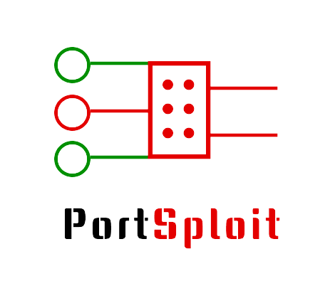

# PortSploit



## Introduction

**PortSploit** is a simple wrapper around the fabulous [**python-nmap**](https://xael.org/pages/python-nmap-en.html) library, supercharging it.

## Why PortSploit

The original nmap-python library lacks quite a few features that users will often need to implement. These include, but are not limited to:

- Session Management
- Session Resume
- Bulk Scans
- Data Serialization
- Easy exports
- Report generation
- Ease of integration with codebases and workflows
- Function-centric approach 
- Data generation based on target info

## Usage

1. Import the required modules and classes:

```python
from portsploit import portsploit # For scanning purposes
from portsploit import generator # For data generation purposes
from portsploit.serializers import to_csv, to_json, to_pickle, to_yml # For serialization purposes
```

2. Setup a ScannerSession

```python
session = portsploit.ScannerSession()
```

## Dependencies

1. **NMap:** Famous port scanner
2. **nmap-python:** Python library for introducing NMap into Python programs
3. **rich:** For text formatting in the Command Line
